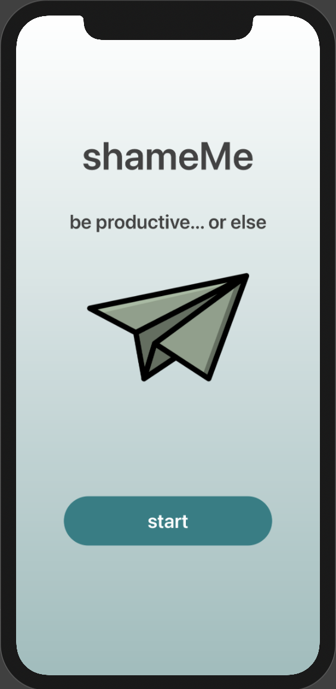
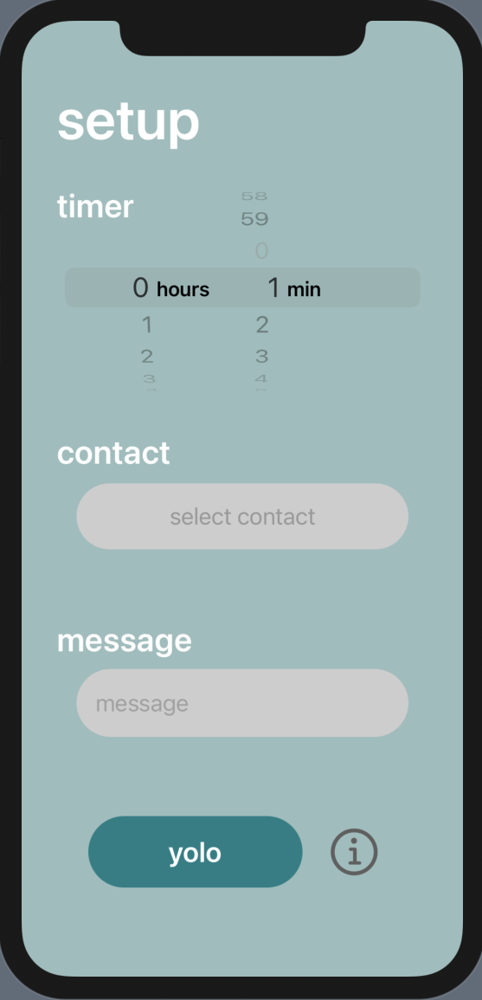

# shameMe-app

A productivity app that sends an embarassing message to an undesirable contact if you slip up. Twilio automates sending an SMS message if you exit the app during a productivity session.

